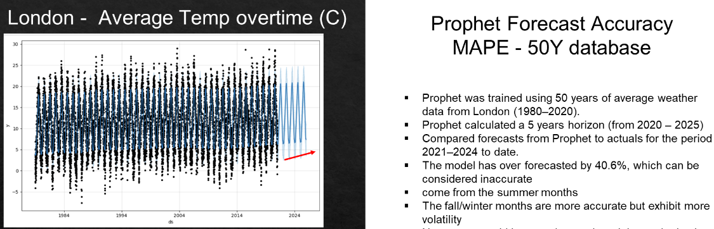

 

# London Weather Projections

## Table of Contents

- [Summary](#summary)
- [Installation](#installation)
- [Example](#example)
- [Results and conlusion of analysis](#results)
- [License](#license)

## Summary

We **analyzed the accuracy of Prophet as a tool to forecast temperature**. Weather data is highly complex and involves interactions between various meteorological variables. *Prophet may not be able to capture all these intricacies effectively.* It is designed to predict one variable at a time. Consequently, it is advisable to use specialized meteorological modeling tools.

## Installation

1. Use PIP install to install Pandas and Prophet

```
!pip3 install pandas
!pip3 install prophet
```

3. We run queries to the Weather API, so we recommend creating and using your own key. Please see the [OpenWeather API section here](https://openweathermap.org/api/one-call-3) for more details. 
4. Download all the repository files to your computer. We recommend using [Jupyter Notebooks](https://jupyter.org/) to read the file.

## Example

Below is one of our key findings. 
 

## Results

This project has provided insights into the accuracy of Prophet as a tool to forecast temperature. Weather data is highly complex and involves interactions between various meteorological variables. Prophet may not be able to capture all these intricacies effectively. It is designed to predict one variable at a time. Consequently, it is advisable to use specialized meteorological modeling tools.

Prophet indeed includes regressors (a way to modify the influence of the variable). These additional regressors could help improve the forecasting accuracy.

**An important conclusion, especially for us as students, is realizing the strengths and weaknesses of the different forecasting tools available to us.** That is in itself a skill.


## License

By including the MIT License in our project, we are granting others the freedom to use, modify, and distribute your code, with minimal restrictions. 

MIT License

Copyright (c) [2024] [The Python Weatherpeople]

Permission is hereby granted, free of charge, to any person obtaining a copy
of this software and associated documentation files (the "Software"), to deal
in the Software without restriction, including without limitation the rights
to use, copy, modify, merge, publish, distribute, sublicense, and/or sell
copies of the Software, and to permit persons to whom the Software is
furnished to do so, subject to the following conditions:

The above copyright notice and this permission notice shall be included in all
copies or substantial portions of the Software.

THE SOFTWARE IS PROVIDED "AS IS", WITHOUT WARRANTY OF ANY KIND, EXPRESS OR
IMPLIED, INCLUDING BUT NOT LIMITED TO THE WARRANTIES OF MERCHANTABILITY,
FITNESS FOR A PARTICULAR PURPOSE AND NONINFRINGEMENT. IN NO EVENT SHALL THE
AUTHORS OR COPYRIGHT HOLDERS BE LIABLE FOR ANY CLAIM, DAMAGES OR OTHER
LIABILITY, WHETHER IN AN ACTION OF CONTRACT, TORT OR OTHERWISE, ARISING FROM,
OUT OF OR IN CONNECTION WITH THE SOFTWARE OR THE USE OR OTHER DEALINGS IN THE
SOFTWARE.


